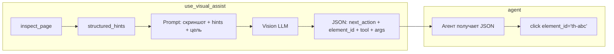

# Enhanced `use_visual_assist` — скриншот + DOM-структура + целевой промпт

## Проблема

Сейчас `use_visual_assist` передаёт vision-модели **только скриншот** и вопрос. Модель не знает:

- Какие `element_id` соответствуют видимым элементам
- Какие поля доступны для ввода (`label`, `placeholder`)
- Какие диалоги открыты
- Конкретную цель пользователя

Результат: модель возвращает **размытые рекомендации** типа «посмотрите на вакансии» вместо конкретных инструкций «кликни `th-abc123` — `Откликнуться`».

## Решение



### Три входа в vision-модель

| Вход | Содержимое | Откуда берётся |
|------|-----------|----------------|
| **Скриншот** | PNG страницы (full viewport) | `session.capture_screenshot_data_url()` |
| **structured_hints** | Кликабельные + поля + диалоги + заголовки | `inspect_page()` → `clickable_hints` + `fillable_hints` + `dialogs` + `headings` |
| **Цель + контекст** | Что хочет пользователь + на каком шаге агент | `goal` + `context_text` из `run_browser_core_loop()` |

### Формат structured_hints

```json
{
    "url": "https://hh.ru/search/vacancy?...",
    "title": "Работа в Москве",
    "headings": ["Найдено 11 вакансий", "Уровень дохода", "Регион"],
    "dialogs": [],
    "clickable": [
        {"text": "Откликнуться", "element_id": "th-00hv9iwz"},
        {"text": "Откликнуться", "element_id": "th-k6c9utzv"},
        {"text": "Senior ML Engineer (LLM / RAG)", "element_id": "th-abc123"},
        {"text": "Удалённо", "element_id": "th-filter-1"}
    ],
    "fillable": [
        {"label": "Поиск по вакансиям", "element_id": "th-mpctcvkx", "value": "Python разработчик"},
        {"label": "Исключить слова", "element_id": "th-wct44kci", "value": "тест, задание"}
    ]
}
```

### Промпт для vision-модели

```
You are a vision-powered browser assistant.

USER GOAL:
{goal}

PAGE STRUCTURE (from DOM inspection):
{structured_hints}

SCREENSHOT: attached below.

Your job: based on the screenshot AND the page structure, decide what the
browser agent should do next to achieve the user's goal.

Return JSON with:
{
  "task_type": "captcha|layout|form|general|apply_action",
  "visible_text": "short visible evidence from the screenshot",
  "next_action": "what to do next (one sentence)",
  "element_id": "exact data-thirdhand-id from the page structure to click/fill",
  "tool": "click|type_text|scroll|press_key|...",
  "tool_args": {"element_id": "...", "text": "..."},
  "confidence": "low|medium|high"
}

CRITICAL RULES:
- Use ONLY element_ids from the PAGE STRUCTURE above. Never invent DOM ids.
- If the goal is to apply to vacancies, look for clickable elements with 
  text="Откликнуться" and return their element_id.
- If there are multiple similar elements, pick the first one that hasn't 
  been processed yet.
- If the page shows a captcha, set task_type="captcha" and return 
  captcha_text, label, placeholder.
- If you cannot find a suitable element, say so and suggest scrolling or 
  navigating differently.
```

### Изменения в [`tools.py`](src/thirdhand/browser_core/tools.py) — функция `use_visual_assist`

```python
async def use_visual_assist(question: str = "...", goal: str = ""):
    # 1. Получаем скриншот
    screenshot = await session.capture_screenshot_data_url()
    current_url = await session.current_url()
    
    # 2. Получаем структуру страницы через inspect_page
    snapshot_json = await session.inspect_page()
    snapshot = json.loads(snapshot_json)
    
    # 3. Собираем структурированные подсказки
    clickable = [
        {"text": el.get("text", "")[:80], "element_id": el.get("id", "")}
        for el in (snapshot.get("actionable") or [])[:20]
        if not el.get("disabled") and not el.get("fillable")
    ]
    fillable = [
        {
            "label": el.get("label", ""),
            "placeholder": el.get("placeholder", ""),
            "element_id": el.get("id", ""),
            "value": el.get("value_preview", ""),
        }
        for el in (snapshot.get("fillable") or [])[:10]
    ]
    
    hints = json.dumps({
        "url": current_url,
        "title": snapshot.get("title", ""),
        "headings": snapshot.get("headings", [])[:5],
        "dialogs": snapshot.get("dialogs", [])[:3],
        "clickable": clickable,
        "fillable": fillable,
    }, ensure_ascii=False, indent=2)
    
    # 4. Отправляем vision-модели
    llm = create_llm(model=vision_model, temperature=0.0)
    response = await ainvoke_with_retry(llm, [
        HumanMessage(content=[
            {"type": "text", "text": build_visual_assist_prompt(
                goal=goal,
                question=question,
                hints=hints,
                current_url=current_url,
            )},
            {"type": "image_url", "image_url": {"url": screenshot}},
        ])
    ])
    
    return response.content
```

### Изменения в [`agent_loop.py`](src/thirdhand/browser_core/agent_loop.py)

При вызове `use_visual_assist` агентом — передавать `goal`:

```python
# В цикле agent_loop.py, при вызове use_visual_assist
# goal уже доступна как параметр run_browser_core_loop
result = await use_visual_assist(question=question, goal=goal)
```

### Что это даёт

| Сценарий | Раньше | Теперь |
|----------|--------|--------|
| Агент на странице поиска hh.ru | Vision: «посмотрите вакансии и выберите» | Vision: `click(element_id='th-00hv9iwz', text='Откликнуться')` |
| Агент на форме входа | Vision: «введите логин и пароль» | Vision: `type_text(element_id='th-xxx', label='Логин', text='...')` |
| Агент на капче | Vision: «на странице капча» | Vision: `captcha_text='abc', label='Текст с картинки'` |
| Любой сайт | Общие рекомендации | Конкретные element_id для взаимодействия |

### Изменяемые файлы

| Файл | Изменение |
|------|-----------|
| [`tools.py`](src/thirdhand/browser_core/tools.py) | Модифицировать `use_visual_assist`: добавить вызов `inspect_page`, сбор `structured_hints`, обновить промпт, передать `goal` |
| [`agent_loop.py`](src/thirdhand/browser_core/agent_loop.py) | Передавать `goal` при вызове `use_visual_assist` (уже доступен как параметр) |
| [`prompts.py`](src/thirdhand/browser_core/prompts.py) | Добавить `build_visual_assist_prompt()` — функция сборки промпта для vision-модели |
| [`test_browser_agent.py`](tests/test_browser_agent.py) | Добавить тесты для нового формата ответа `use_visual_assist` |

### Формат ответа — детальнее

Vision-модель возвращает JSON, который парсится в `_parse_visual_payload()`. Добавляем новые поля:

```python
# Текущая структура:
{
    "task_type": "general",
    "visible_text": "...",
    "captcha_text": "",
    "label": "",
    "placeholder": "",
    "button_hint": "",
    "next_action": "...",
    "confidence": "high"
}

# Новая структура (добавлены element_id, tool, tool_args):
{
    "task_type": "apply_action",
    "visible_text": "11 вакансий, кнопки Откликнуться",
    "captcha_text": "",
    "label": "",
    "placeholder": "",
    "button_hint": "",
    "next_action": "Click the first Откликнуться button",
    "element_id": "th-00hv9iwz",
    "tool": "click",
    "tool_args": {"element_id": "th-00hv9iwz", "text": "Откликнуться"},
    "confidence": "high"
}
```

### Обработка ответа в agent_loop.py

Когда `use_visual_assist` возвращает результат с `element_id` и `tool`, агент может **сразу** использовать эти значения:

```python
if tool_name == "use_visual_assist":
    visual_payload = _parse_visual_payload(result)
    
    # Если vision-модель вернула конкретный tool — исполняем сразу
    suggested_tool = visual_payload.get("tool")
    suggested_args = visual_payload.get("tool_args", {})
    element_id = visual_payload.get("element_id")
    
    if suggested_tool and element_id:
        # Автоматически выполняем предложенное действие
        messages.append(HumanMessage(
            content=f"Use these exact values: {suggested_tool}({suggested_args})"
        ))
```

### Почему это масштабируемо

- **Не зависит от сайта**: vision-модель видит и скриншот, и DOM — понимает любой layout
- **Не зависит от языка**: текст элементов на любом языке понятен vision-модели
- **Никакого скоринга**: vision-модель сама решает, какой element_id использовать
- **Конкретные действия**: вместо общих советов — точные команды для Playwright
