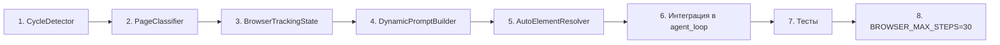

# Масштабируемая архитектура Browser Agent

## Обзор

Пять новых компонентов, которые решают проблему зацикливания и неэффективности browser core на **любом сайте**, а не только на hh.ru.

---

## Компонент 1: CycleDetector

**Файл**: `src/thirdhand/browser_core/cycle_detector.py` (новый)

**Назначение**: Универсальный детектор поведенческих циклов, не привязанный к URL или конкретному сайту.

### Структурная сигнатура (без URL)

```python
@staticmethod
def structural_signature(snapshot: dict) -> str:
    """Сигнатура только из структуры страницы — URL исключён."""
    return json.dumps({
        "headings": [h for h in (snapshot.get("headings") or [])[:4]],
        "dialogs": [d for d in (snapshot.get("dialogs") or [])[:3]],
        "fillable_count": len(snapshot.get("fillable") or []),
        "actionable_count": len(snapshot.get("actionable") or []),
        "text_hash": hash((snapshot.get("text") or "")[:1000]),
    }, sort_keys=True)
```

### Детектируемые паттерны

| Паттерн | Условие | Пример |
|---------|---------|--------|
| **Повтор** | Один и тот же tool_name + canonical_args 3+ раза подряд | click(id='th-xxx') × 3 |
| **Toggle-цикл** | A→B→A→B в последних 4 действиях | click(FULL) → click(REMOTE) → click(FULL) → click(REMOTE) |
| **Структурный застой** | Структурная сигнатура не меняется 3+ шага, хотя URL меняется | URL: ?page=1 → ?page=2, но контент тот же |

### Интерфейс

```python
@dataclass
class CycleDetector:
    structural_history: deque[dict] = field(default_factory=lambda: deque(maxlen=5))
    action_history: deque[tuple[str, str]] = field(default_factory=lambda: deque(maxlen=6))
    
    def record_action(self, tool_name: str, canonical_args: str, structural_sig: str) -> None:
        """Записать действие и структурную сигнатуру."""
    
    def is_cycling(self) -> bool:
        """True если обнаружен цикл."""
    
    def structural_signature(self, snapshot: dict) -> str:
        """Сигнатура без URL."""
```

### Тесты

```python
# tests/test_cycle_detector.py
def test_detects_same_action_repeated():
    d = CycleDetector()
    for _ in range(3):
        d.record_action("click", '{"element_id":"th-x"}', "sig1")
    assert d.is_cycling()

def test_detects_toggle_cycle():
    d = CycleDetector()
    d.record_action("click", '{"element_id":"th-a"}', "sig1")
    d.record_action("click", '{"element_id":"th-b"}', "sig2")
    d.record_action("click", '{"element_id":"th-a"}', "sig1")
    d.record_action("click", '{"element_id":"th-b"}', "sig2")
    assert d.is_cycling()

def test_structural_stagnation():
    d = CycleDetector()
    for _ in range(3):
        d.record_action("click", '{"element_id":"th-x"}', '{"headings":[],"text_hash":123}')
    assert d.is_cycling()

def test_no_false_positive_on_progress():
    d = CycleDetector()
    d.record_action("click", "a", "sig1")
    d.record_action("type_text", "b", "sig2")
    d.record_action("click", "c", "sig3")
    assert not d.is_cycling()
```

---

## Компонент 2: PageClassifier

**Файл**: `src/thirdhand/browser_core/page_classifier.py` (новый)

**Назначение**: Классификация типа страницы по структурным признакам — без LLM, без хардкода под конкретный сайт.

### Классификатор

```python
class PageType(str, Enum):
    SEARCH_RESULTS = "search_results"
    DETAIL_PAGE = "detail_page"
    FORM_PAGE = "form_page"
    LOGIN_PAGE = "login_page"
    GENERIC_PAGE = "generic_page"

class PageClassifier:
    @staticmethod
    def classify(snapshot: dict) -> PageType:
        """Классифицировать страницу по snapshot от inspect_page."""
```

### Эвристики классификации (языконезависимые)

Все эвристики используют только **стандартизированные HTML-свойства** и **структурные паттерны** — никаких ключевых слов на естественных языках.

| Тип | Условия | Почему это масштабируемо |
|-----|---------|--------------------------|
| **login_page** | Есть fillable с `type=password` (HTML-стандарт) | `<input type="password">` одинаков во всех языках и странах |
| **form_page** | 4+ fillable элементов | Любая форма на любом языке содержит много полей ввода |
| **search_results** | 5+ actionable с `tag=a` или `role=link`, И <= 2 fillable, ИЛИ есть элементы с `role=list` или `role=listitem` | Список результатов всегда содержит много ссылок и мало форм |
| **detail_page** | <= 3 headings, <= 5 actionable, 0-2 fillable, нет type=password | Страница детального просмотра — мало интерактивных элементов |
| **generic_page** | Всё остальное | Fallback |

### Интерфейс

```python
@staticmethod
def classify(snapshot: dict) -> PageType:
    """Вернуть тип страницы."""

@staticmethod
def guidance_for(page_type: PageType) -> str:
    """Вернуть текстовую инструкцию для агента на русском."""
```

### Тесты (языконезависимые)

```python
def test_classify_search_results():
    """Список ссылок без форм = search_results, любой язык."""
    snap = {
        "text": "any language text here español 日本語",
        "actionable": [{"tag": "a", "role": ""} for _ in range(8)],
        "fillable": [{"type": "text"}],
        "headings": ["Results"],
    }
    assert PageClassifier.classify(snap) == PageType.SEARCH_RESULTS

def test_classify_login_page():
    """Наличие password-поля = login_page, независимо от языка."""
    snap = {
        "text": "iniciar sesión iniciar contraseña",
        "fillable": [
            {"type": "text", "autocomplete": "username"},
            {"type": "password", "autocomplete": "current-password"},
        ],
        "actionable": [{"tag": "button"}],
    }
    assert PageClassifier.classify(snap) == PageType.LOGIN_PAGE

def test_classify_login_page_japanese():
    """Японский сайт — тот же HTML-стандарт type=password."""
    snap = {
        "text": "ログイン パスワード",
        "fillable": [
            {"type": "email"},
            {"type": "password"},
        ],
        "actionable": [{"tag": "button"}],
    }
    assert PageClassifier.classify(snap) == PageType.LOGIN_PAGE

def test_classify_form():
    """4+ полей ввода = form_page, любой язык."""
    snap = {
        "fillable": [
            {"type": "text"}, {"type": "text"},
            {"type": "textarea"}, {"type": "text"},
        ],
        "actionable": [{"tag": "button"}],
    }
    assert PageClassifier.classify(snap) == PageType.FORM_PAGE

def test_classify_detail_page():
    """Мало элементов = detail_page."""
    snap = {
        "headings": ["Product Name"],
        "actionable": [{"tag": "button"}, {"tag": "a"}],
        "fillable": [],
    }
    assert PageClassifier.classify(snap) == PageType.DETAIL_PAGE
```

---

## Компонент 3: AutoElementResolver

**Файл**: модификация `src/thirdhand/browser_core/tools.py`

**Назначение**: Автоматическое обнаружение element_id через inspect_page, когда все первичные локаторы (element_id, label, placeholder) не сработали.

### Модификация type_text

Текущий fallback chain:
```
element_id → label → placeholder → ERROR
```

Новый fallback chain:
```
element_id → label → placeholder → AUTO_DISCOVERY(inspect_page) → ERROR
```

### Функция _best_match

```python
def _best_match(candidates: list[dict], label: str, placeholder: str) -> dict | None:
    """Найти лучшее совпадение среди fillable элементов.
    
    Система скоринга:
    - Точное совпадение label: +10
    - Частичное совпадение label: +5
    - Точное совпадение placeholder: +10
    - Частичное совпадение placeholder: +5
    - Пустое поле (нет value): +2 (предпочитаем пустые поля)
    """
```

### Модификация type_text в tools.py

```python
async def type_text(text, element_id="", label="", placeholder="", exact=False, submit=False):
    # ... существующий код ...
    
    # Если всё упало — AUTO DISCOVERY
    snapshot_json = await session.inspect_page()
    snapshot = json.loads(snapshot_json)
    target = _best_match(snapshot.get("fillable", []), label, placeholder)
    if target and target.get("id"):
        return await session.type_text(target["id"], text, submit=submit)
    
    raise  # последняя ошибка
```

### Тесты

```python
def test_best_match_exact_label():
    candidates = [
        {"id": "th-1", "label": "Имя", "placeholder": "", "value_preview": ""},
        {"id": "th-2", "label": "Email", "placeholder": "", "value_preview": ""},
    ]
    result = _best_match(candidates, "Email", "")
    assert result["id"] == "th-2"

def test_best_match_prefers_empty():
    candidates = [
        {"id": "th-1", "label": "Имя", "placeholder": "", "value_preview": "John"},
        {"id": "th-2", "label": "Имя", "placeholder": "", "value_preview": ""},
    ]
    result = _best_match(candidates, "Имя", "")
    assert result["id"] == "th-2"

def test_best_match_returns_none_on_empty():
    assert _best_match([], "label", "") is None
```

---

## Компонент 4: DynamicPromptBuilder

**Файл**: модификация `src/thirdhand/browser_core/prompts.py`

**Назначение**: Сборка system prompt из блоков в зависимости от контекста (тип страницы, статус прогресса, обнаруженные циклы).

### Новая функция

```python
def build_adaptive_system_prompt(
    context_text: str = "",
    page_type: str = "generic_page",
    no_progress_streak: int = 0,
    cycle_detected: bool = False,
) -> str:
    """Собрать system prompt из блоков."""
```

### Блоки промпта

1. **Базовый блок** — существующий `build_browser_core_system_prompt()`
2. **Page-type guidance** — инструкция в зависимости от типа страницы:

```python
PAGE_TYPE_GUIDANCE = {
    "search_results": (
        "\n---\n"
        "📋 PAGE TYPE: SEARCH RESULTS / LISTING\n"
        "You are on a page with a list of items.\n"
        "1. Look for clickable item titles or links in the list.\n"
        "2. Click on an item to open its details.\n"
        "3. Do NOT click on filters, tabs, checkboxes,\n" 
        "or sorting controls if nobody askedto.\n"
        "4. If you don't see items, scroll down to reveal more.\n"
        "5. After opening an item, look for the primary action button."
    ),
    "detail_page": (
        "\n---\n"
        "📋 PAGE TYPE: DETAIL PAGE\n"
        "You are viewing details of a single item.\n"
        "1. Look for the primary action button (apply, buy, submit, etc.).\n"
        "2. Scroll to find it if not visible in the viewport.\n"
        "3. If a form is required, fill it using the user's provided data."
    ),
    "form_page": (
        "\n---\n"
        "📋 PAGE TYPE: FORM\n"
        "You need to fill in a form.\n"
        "1. Fill required fields using data from the user's goal.\n"
        "2. Use type_text with element_id from inspect_page.\n"
        "3. After filling, look for a submit/save button."
    ),
    "login_page": (
        "\n---\n"
        "📋 PAGE TYPE: LOGIN\n"
        "A login form is visible.\n"
        "1. If you have credentials, fill them in.\n"
        "2. If no credentials available, call ask_user."
    ),
}
```

3. **Anti-cycle блок** — только если cycle_detected=True:

```python
CYCLE_WARNING = (
    "\n---\n"
    "⚠️ CYCLE DETECTED: You are repeating the same actions.\n"
    "STOP. Take a completely different approach:\n"
    "- Use use_visual_assist to see what's on the page\n"
    "- Try scrolling to find new content\n"
    "- Look for elements you haven't tried yet\n"
    "- If truly stuck, call ask_user for guidance"
)
```

4. **Stuck tip блок** — только если no_progress_streak >= 1:

```python
STUCK_TIP = (
    "\n---\n"
    "💡 TIP: If you're on a list/search results page, click on an item title/link "
    "to open it. Don't click on filters, tabs, or sorting controls."
)
```

### Тесты

```python
def test_adaptive_prompt_includes_page_type():
    prompt = build_adaptive_system_prompt(page_type="search_results")
    assert "SEARCH RESULTS" in prompt

def test_adaptive_prompt_includes_cycle_warning():
    prompt = build_adaptive_system_prompt(cycle_detected=True)
    assert "CYCLE DETECTED" in prompt

def test_adaptive_prompt_no_cycle_when_not_needed():
    prompt = build_adaptive_system_prompt(cycle_detected=False)
    assert "CYCLE DETECTED" not in prompt
```

---

## Компонент 5: BrowserTrackingState

**Файл**: `src/thirdhand/browser_core/tracking.py` (новый)

**Назначение**: Единое состояние трекинга, заменяющее разрозненные переменные в agent_loop.py.

### Dataclass

```python
@dataclass
class BrowserTrackingState:
    """Unified tracking state for the browser loop."""
    
    # Cycle detection
    structural_history: deque[dict] = field(default_factory=lambda: deque(maxlen=5))
    action_history: deque[tuple[str, str]] = field(default_factory=lambda: deque(maxlen=6))
    
    # Progress tracking
    no_progress_streak: int = 0
    no_tool_steps: int = 0
    visual_assist_same_page_streak: int = 0
    last_structural_signature: str = ""
    last_action_signature: str = ""
    last_visual_signature: str = ""
    
    # Page awareness
    page_type: str = "generic_page"
    
    def record_action(self, tool_name: str, args: dict, snapshot: dict) -> None:
        """Записать действие и обновить состояние."""
    
    def structural_signature(self, snapshot: dict) -> str:
        """Сигнатура без URL."""
    
    def is_cycling(self) -> bool:
        """True если обнаружен цикл."""
    
    def check_progress(self, tool_name: str, tool_failed: bool, snapshot: dict) -> bool:
        """Проверить, был ли прогресс. Вернуть True если был."""
```

### Что заменяет в agent_loop.py

| Старая переменная | Новый источник |
|-------------------|----------------|
| `no_tool_steps` | `tracking.no_tool_steps` |
| `no_progress_streak` | `tracking.no_progress_streak` |
| `visual_assist_same_page_streak` | `tracking.visual_assist_same_page_streak` |
| `last_visual_signature` | `tracking.last_visual_signature` |
| `last_action_signature` | `tracking.last_action_signature` |
| `last_state_signature` | `tracking.last_structural_signature` |
| `_page_signature()` | `tracking.structural_signature()` |
| (нет) | `tracking.page_type` |
| (нет) | `tracking.is_cycling()` |

### Тесты

```python
def test_tracking_initial_state():
    t = BrowserTrackingState()
    assert t.no_progress_streak == 0
    assert t.page_type == "generic_page"

def test_tracking_records_action():
    t = BrowserTrackingState()
    t.record_action("click", {"element_id": "th-x"}, {"headings": [], "text": ""})
    assert len(t.action_history) == 1
    assert len(t.structural_history) == 1
```

---

## Интеграция в agent_loop.py

### Изменения в `run_browser_core_loop()`

```python
# Вместо:
no_tool_steps = 0
no_progress_streak = 0
visual_assist_same_page_streak = 0
last_visual_signature = ""
last_action_signature = ""
last_state_signature = _page_signature(latest_snapshot)

# Будет:
tracking = BrowserTrackingState()
tracking.last_structural_signature = tracking.structural_signature(latest_snapshot)
```

### После каждого inspect_page:

```python
# Классификация страницы (не каждый раз, а когда snapshot меняется)
if progress_changed or tracking.page_type == "generic_page":
    tracking.page_type = PageClassifier.classify(latest_snapshot)
```

### После каждого tool call:

```python
# Запись действия
tracking.record_action(tool_name, args, latest_snapshot)

# Проверка прогресса с учётом циклов
progress_changed = tracking.check_progress(tool_name, tool_failed, latest_snapshot)
```

### При сборке system prompt:

```python
# В начале цикла или при изменении состояния:
system_prompt = build_adaptive_system_prompt(
    context_text=context_text,
    page_type=tracking.page_type,
    no_progress_streak=tracking.no_progress_streak,
    cycle_detected=tracking.is_cycling(),
)
```

**Важно**: system prompt не нужно пересобирать на каждом шаге — только когда:
1. Тип страницы изменился
2. Обнаружен цикл
3. no_progress_streak достиг порога (1 или 2)

---

## Обновление конфигурации

**Файл**: `src/thirdhand/config/settings.py`

```python
# Было:
BROWSER_MAX_STEPS: int = 18

# Стало:
BROWSER_MAX_STEPS: int = 30
```

---

## Порядок реализации



1. **CycleDetector** — независимый модуль, можно тестировать изолированно
2. **PageClassifier** — независимый модуль, можно тестировать изолированно
3. **BrowserTrackingState** — объединяет CycleDetector + счётчики
4. **DynamicPromptBuilder** — модификация prompts.py
5. **AutoElementResolver** — модификация tools.py
6. **Интеграция** — замена переменных в agent_loop.py на BrowserTrackingState
7. **Тесты** — unit-тесты для каждого компонента
8. **BROWSER_MAX_STEPS** — финальное изменение конфига

---

## Файлы, которые будут изменены/созданы

| Файл | Действие |
|------|----------|
| `src/thirdhand/browser_core/cycle_detector.py` | ✅ Создать |
| `src/thirdhand/browser_core/page_classifier.py` | ✅ Создать |
| `src/thirdhand/browser_core/tracking.py` | ✅ Создать |
| `src/thirdhand/browser_core/prompts.py` | 🔧 Модифицировать |
| `src/thirdhand/browser_core/tools.py` | 🔧 Модифицировать |
| `src/thirdhand/browser_core/agent_loop.py` | 🔧 Модифицировать |
| `src/thirdhand/config/settings.py` | 🔧 Модифицировать |
| `src/thirdhand/browser_core/__init__.py` | 🔧 Модифицировать (экспорты) |
| `tests/test_cycle_detector.py` | ✅ Создать |
| `tests/test_page_classifier.py` | ✅ Создать |
| `tests/test_tracking.py` | ✅ Создать |